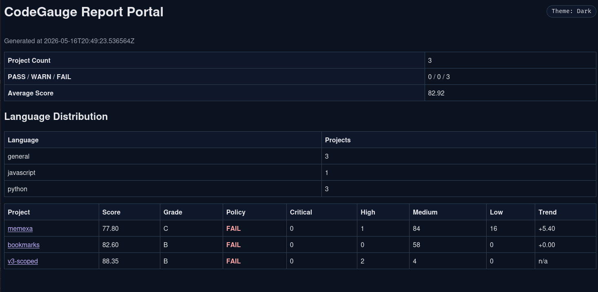
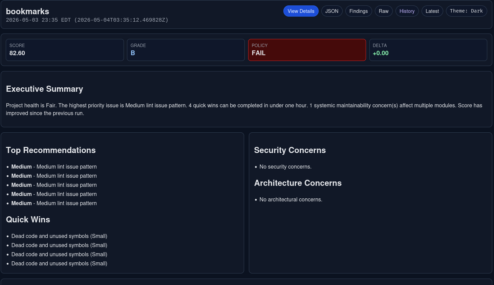
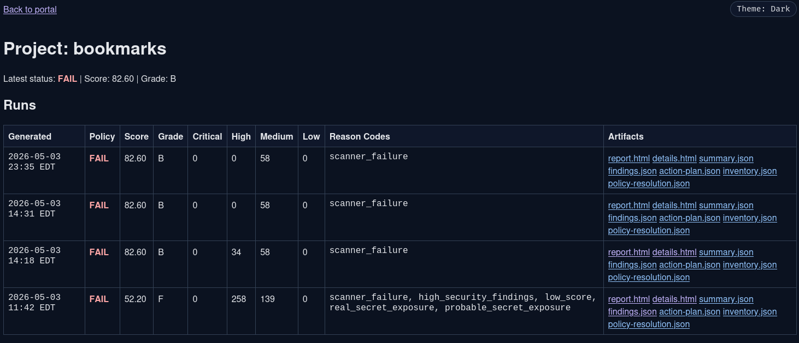
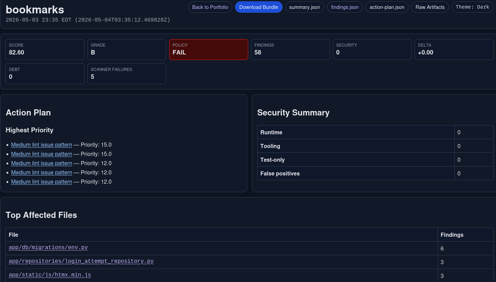

# CodeGauge

CodeGauge is a deterministic, local-first code quality and security analysis platform.

## Supported Languages

- Python
- JavaScript / TypeScript
- Java
- Go
- PHP
- Secrets domain scanning

## Install

```bash
uv sync
uv run codegauge --help
```

Scanner prerequisites and install helper:

```bash
./install-scanners.sh --help
./install-scanners.sh --profile core --init-config
```

See `SCANNER_INSTALL.md` for generic and language-specific setup.

## Quickstart

```bash
uv run codegauge scan .
uv run codegauge scan . --json
uv run codegauge secrets scan .
```

When scanning an unmanaged local project (no `.codegauge.toml` and no common linter config), CodeGauge shows a bootstrap hint to initialize baseline config files.

## Secrets Pattern Override (Add/Remove Only)

```toml
[secrets]
ignored_sensitive_patterns_add = [
  "*.mobileprovision",
  "vault.json",
]
ignored_sensitive_patterns_remove = [
  "*.sqlite",
]
```

CodeGauge keeps secure built-in defaults, then applies additions and removals deterministically.

## Report

CodeGauge writes artifacts and a static portal under your configured `report_root` (default `~/Documents/CodeGauge`).

Sample report path:

`~/Documents/CodeGauge/index.html`

## Screenshots

### Main Page



### Project Page



### Report Page



### Details Page



## Why Deterministic Analysis

- Stable scope and finding ordering.
- Stable policy reason codes.
- Predictable CI and portfolio reporting.

## License

Apache-2.0
